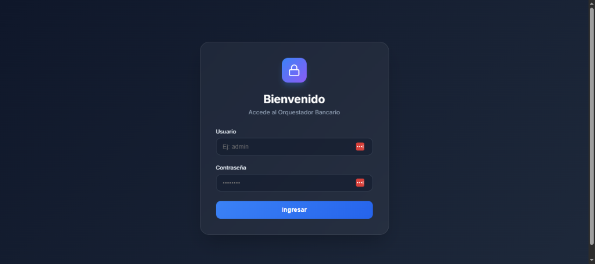
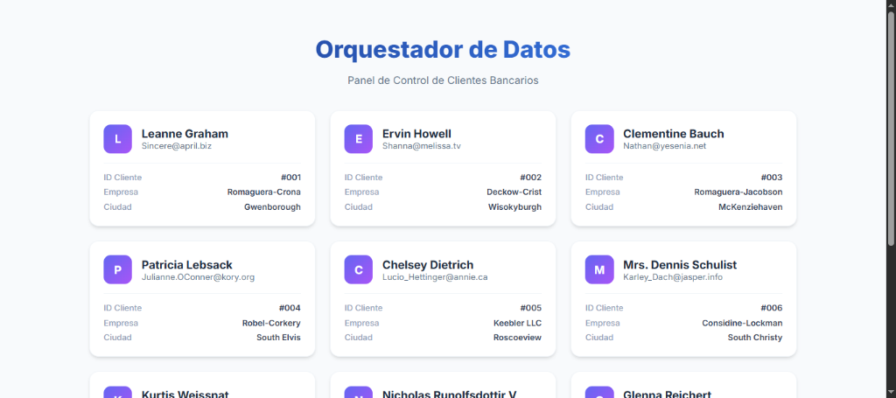

# 🏦 Bank Data Orchestrator


## 📝 Descripción
**Bank Data Orchestrator** es una solución profesional diseñada para la gestión segura y centralizada de flujos de datos bancarios. Actúa como una capa intermedia (Orquestador) que garantiza que el cliente nunca interactúe directamente con APIs sensibles, implementando patrones de seguridad de grado empresarial.

### ✨ Pilares del Proyecto
*   **Seguridad Invisible:** Capa de autenticación JWT robusta.
*   **Orquestación de Datos:** Consumo inteligente de servicios externos vía backend.
*   **Arquitectura Monorepo:** Estructura organizada y escalable.
*   **UI/UX Premium:** Interfaz de usuario moderna, limpia y responsiva.

---

## 📸 Galería del Proyecto

### 🔐 Acceso Seguro
Interfaz de login minimalista con validación en tiempo real.


### 📊 Panel de Control (Dashboard)
Visualización enriquecida de datos orquestados desde servicios externos.


---

## 🛠️ Stack Tecnológico

| Capa | Tecnología | Función |
| :--- | :--- | :--- |
| **Frontend** | Angular 21 | Interfaz de usuario dinámica |
| **Backend** | Node.js + Express | Motor de orquestación y lógica |
| **Seguridad** | JWT (JSON Web Tokens) | Gestión de sesiones y permisos |
| **Fuentes** | REST APIs (Exteriores) | Origen de datos (JSONPlaceholder) |
| **DevOps** | Docker | Contenerización y despliegue |

---

## 🚀 Guía de Inicio Rápido

### Prerrequisitos
- Node.js (v18+)
- NPM o PNPM

### Instalación y Ejecución
```bash
# 1. Clonar e instalar dependencias
git clone https://github.com/mariomina/bank-data-orchestrator.git
cd bank-data-orchestrator

# 2. Configurar Servidor
cd server && npm install
# (Asegúrate de configurar el .env con tu JWT_SECRET)

# 3. Configurar y Compilar Cliente
cd ../client && npm install
npm run build

# 4. Iniciar Aplicación
cd ../server && npm start
```

Visita: `http://localhost:3000`

---

## 📄 Licencia
Este proyecto es **Open Source** y está bajo la [Licencia MIT](LICENSE).

---

## 🧑‍💻 Autor
Desarrollado con ❤️ para el ecosistema AIOS.
