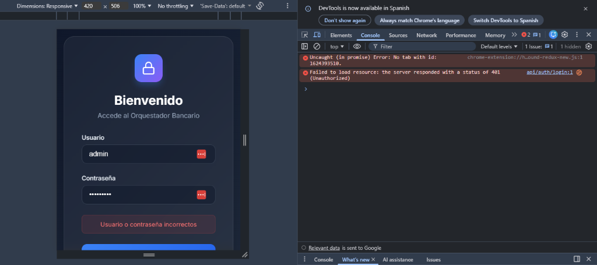

# 🏦 Bank Data Orchestrator


## Descripción
Esta es una aplicación **Full-Stack** diseñada como un "Orquestador de Datos Bancarios". Su propósito principal es demostrar una arquitectura segura de Cliente-Servidor donde el frontend no consume datos directamente, sino que todas las peticiones son proxy-ficadas y enriquecidas por un backend seguro.

### ✨ Características Principales
*   **Arquitectura:** Monorepo (Angular + Node.js/Express).
*   **Seguridad:** Autenticación JWT y credenciales robustas.
*   **Orquestación:** Consumo de APIs externas simuladas a través del backend.
*   **Diseño:** Interfaz moderna y responsiva.

---

## 📸 Capturas de Pantalla

### Login (Seguro)
Acceso restringido solo para personal autorizado.


*(Nota: Dashboard consume datos de JSONPlaceholder para demostración)*

---

## 🛠️ Stack Tecnológico

| Componente | Tecnología | Versión |
| :--- | :--- | :--- |
| **Frontend** | Angular | v17+ |
| **Backend** | Node.js + Express | Latest |
| **Fuente de Datos** | [JSONPlaceholder](https://jsonplaceholder.typicode.com/) | API Externa |
| **Container** | Docker | Ready |

---

## 🚀 Cómo Iniciar

### Prerrequisitos
- Node.js (v18+)
- Docker (Opcional)

### Instalación Rápida
```bash
# 1. Instalar dependencias
cd server && npm install
cd ../client && npm install

# 2. Compilar Frontend
cd ../client && npm run build

# 3. Lanzar Orquestador
cd ../server && npm start
```

Visita: `http://localhost:3000`

---

## 📄 Licencia
Este proyecto es **Open Source** y está disponible bajo la licencia **MIT**. Siéntete libre de usarlo, modificarlo y distribuirlo.

```text
MIT License

Copyright (c) 2026

Permission is hereby granted, free of charge, to any person obtaining a copy
of this software and associated documentation files...
```
